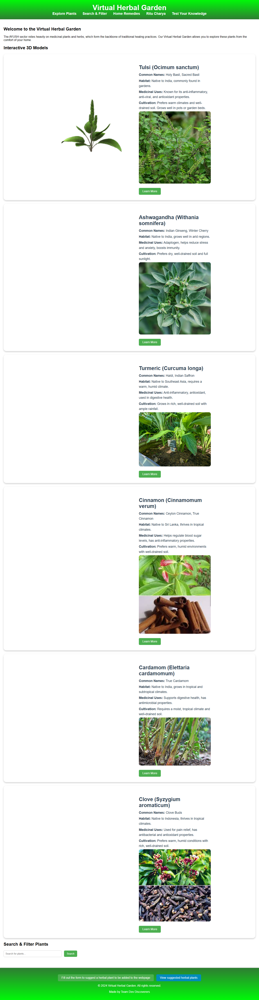
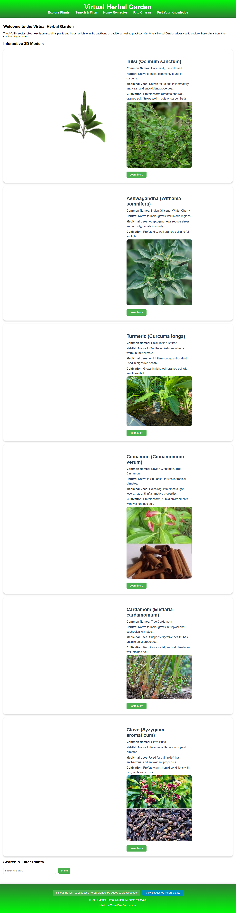
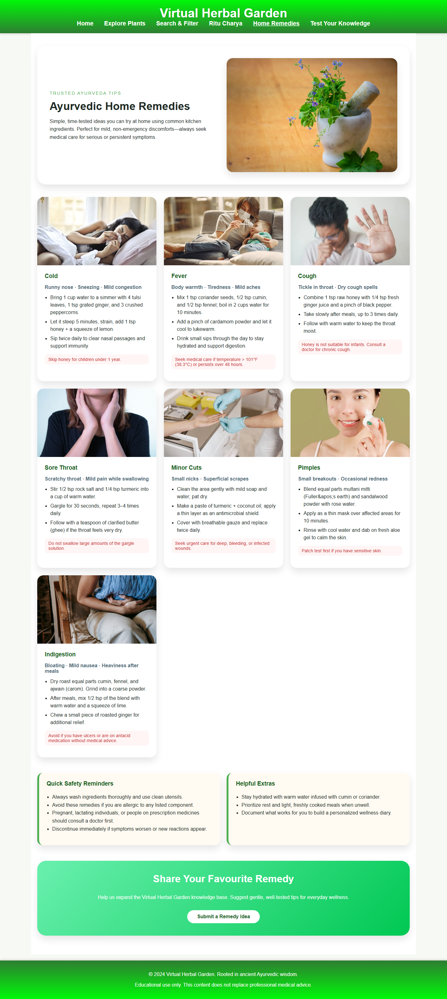

# Virtual Garden

An educational microsite that showcases Ayurvedic wisdom through interactive plant models, seasonal routines, quizzes, and a curated collection of gentle home remedies.

## ✨ Highlights

- **Immersive plant explorer (`index.html`)** – View medicinal plants in 3D using `<model-viewer>`, read quick facts, and filter by ailment.
- **Ritu Charya guide (`ritu-charya1.html`)** – Season-wise habits derived from classical Ayurvedic texts.
- **Knowledge quiz (`quiz.html`)** – Ten-question, auto-scored quiz that reinforces key takeaways.
- **Home-remedy library (`ayurvedic-remedies.html`)** – Kitchen-friendly tips for coughs, colds, sore throats, pimples, minor cuts, and other mild discomforts, each paired with attribution-safe imagery.

## 🌐 Live demos

- GitHub Pages: https://jeevankaliregowda.github.io/virtual-garden/
- Netlify: https://ayush-herbal-garden.netlify.app/

## 📸 Preview





## 🚀 Getting started

1. Clone or download this repository.
2. Serve the project over HTTP/HTTPS (for example `python -m http.server 8000`, `npx serve .`, or VS Code Live Server). Browsers block `.glb` files on the `file://` protocol, so a local server is required for the 3D plants to appear.
3. Keep the `models`, `images`, `scripts`, and `styles` folders at the same level as the HTML files so relative paths resolve correctly.

### Optional tooling

- **Quick static server:** Any zero-config static server CLI works; pick your favorite.
- **Screenshot automation:** See `scripts/capture_screenshots.py` to regenerate the preview images inside `screenshots/` using Playwright + Chromium.

#### Updating screenshots

```
python -m pip install --user playwright
python -m playwright install chromium
python scripts/capture_screenshots.py
```

The script visits the GitHub Pages, Netlify, and remedies URLs, then saves full-page PNGs to `screenshots/`.

## 🤝 Contributing ideas

Have a verified herbal tip or plant to suggest? Use the Google Form linked in the site footer to submit your recommendation and help expand the Virtual Herbal Garden knowledge base.

## 📜 License

This project is licensed under the [MIT License](LICENSE).
